# 🤖 AI Agent Deployment: Self-Hosted vs API Model Comparison

This document compares how you can deploy an AI-powered incident analysis agent using **self-hosted models** or **cloud-based API models**.

---

## 🧠 Agent Objective

Build an AI agent that:
1. Accepts an incident ID (e.g. from PagerDuty)
2. Queries tools like Splunk, New Relic, GitHub
3. Analyzes data
4. Returns a root cause incident report

---

## ⚔️ Options Overview

| Option        | Description                    |
|---------------|--------------------------------|
| Self-Hosted   | Run model locally with Ollama  |
| API-Based     | Call Claude, GPT, etc. via API |

---

## ✅ Self-Hosted Models (Ollama)

| Model      | Pros                           | Cons                         |
|------------|--------------------------------|------------------------------|
| Phi-3      | Fast, low resource             | Weak at deep reasoning       |
| Mistral    | Solid performance              | Slower on CPU                |
| LLaMA 3    | High quality                   | Requires >16GB RAM           |
| Gemma      | Research-optimized             | Still catching up in quality |

**💰 Cost:** Free  
**🔒 Privacy:** Fully local  
**🧠 Ideal for:** Full control, offline mode, no cost.

---

## ✅ Cloud API Models

| Model           | Pros                                  | Cons                     | Est. Cost (per 1M tokens) |
|------------------|----------------------------------------|---------------------------|----------------------------|
| Claude 3 Opus     | Best reasoning, 200K context           | Expensive                 | $15 input / $75 output     |
| Claude 3 Sonnet   | Balance of cost + intelligence         | Less smart than Opus      | $3 / $15                   |
| GPT-4o            | Fast + excellent reasoning             | Some quota limits         | $5 / $15                   |
| GPT-3.5           | Fast + cheap                           | Not great at reasoning    | $0.5 / $1.5                |
| Cohere Command R  | Good for RAG pipelines                 | Less known                | Free tier available        |

**💰 Cost:** Pay per token  
**☁️ Internet:** Required  
**🧠 Ideal for:** Best reasoning, multi-turn memory, fast prototyping.

---

## 🔁 Flow Comparison

| Step                      | Self-Hosted                      | API-Based                            |
|---------------------------|----------------------------------|--------------------------------------|
| Incident input            | Trigger prompt locally           | Trigger prompt via API               |
| Model planning            | Local reasoning loop             | Remote reasoning in Claude/GPT       |
| Tool calls                | Handled directly in local agent  | Your code executes between prompts   |
| Replanning                | Re-looped with local model       | Requires another API call            |
| Final report              | Returned by local logic          | Generated by Claude or GPT           |

---

## 🧠 Key Differences

| Feature              | Self-Hosted     | API Model          |
|----------------------|------------------|---------------------|
| Cost per run         | Free             | Pay per token       |
| Data Privacy         | Full local       | Sent to cloud       |
| Model Quality        | Medium           | High (Claude/GPT)   |
| Latency              | Hardware-based   | Fast via cloud      |
| Context size         | Smaller (<32K)   | Huge (up to 200K)   |
| Memory/persistence   | You must build   | Handled by LLM      |

---

## ✅ When to Choose What

| Goal                         | Recommendation            |
|------------------------------|----------------------------|
| Best reasoning               | Claude 3 Opus or GPT-4o    |
| Free forever                 | Self-hosted via Ollama     |
| Full privacy                 | Self-hosted                |
| Fastest to test              | Claude 3 Sonnet / GPT-4o   |
| Custom tool orchestration    | Both are usable            |

---

## 🧪 Example Flow: Incident ABC123

| Flow       | Self-Hosted                          | API-Based (Claude)               |
|------------|---------------------------------------|----------------------------------|
| Input      | `run_agent("ABC123")`                | Send prompt via Claude API       |
| Call 1     | `query_pagerduty("ABC123")`           | Prompt says: "call PagerDuty..." |
| Call 2     | `query_splunk(...)`                   | Claude suggests it               |
| Analysis   | `generate_report()`                   | Claude creates markdown report   |

---

## 🧬 Hybrid Option (Best of Both)

- Run tools locally
- Let Claude handle analysis + report:

```python
summary = summarize_locally()
final_report = call_claude("Summarize this:
" + summary)
```

---

## ✅ Summary

Use **self-hosted** when:
- You care about cost or privacy
- Your infra supports CPU/GPU load

Use **API model** when:
- You need best-in-class reasoning
- You want fast results, less setup


---

## 🔌 Where MCP Server Interacts

| Role of MCP Server | Self-Hosted Model           | API-Based Model                |
|--------------------|-----------------------------|--------------------------------|
| Tool execution     | Called directly by local agent or model | Triggered after LLM suggests action |
| Integration style  | Local Python function calls | HTTP APIs / middle-layer logic |
| Loop control       | In your script/agent        | Driven by multiple LLM API calls |
| Dependency         | Tightly coupled             | Loosely coupled / stateless    |

---

## 🏗️ Deployment Differences

| Step                  | Self-Hosted                        | API-Based                          |
|-----------------------|------------------------------------|------------------------------------|
| LLM Hosting           | Requires Ollama + model pull       | None – uses hosted Claude/GPT      |
| Network Requirements  | Local or internal only             | Must allow outbound HTTPS          |
| Tool Call Execution   | Fully local                        | Often cloud calls + API gateway    |
| Secrets Management    | Env vars or Docker secrets         | API keys for OpenAI/Anthropic      |
| Latency Control       | You manage performance             | Offloaded to provider              |

---

## 🖼️ Architecture Diagram (Mermaid)

```mermaid
graph LR
    subgraph Self-Hosted Agent
        A1["User / PagerDuty Trigger"]
        B1["Prompt Handler (Local)"]
        C1["Self-Hosted LLM (Phi-3, Mistral, etc)"]
        D1["MCP Server Tool Layer"]
        E1["📄 Report Output"]

        A1 --> B1 --> C1
        C1 --> D1 --> C1
        C1 --> E1
    end

    subgraph API-Based Agent
        A2["User / PagerDuty Trigger"]
        B2["Prompt to Claude / GPT API"]
        C2["Claude 3 / GPT-4o"]
        D2["MCP Server Tool Layer"]
        E2["📄 Report Output"]

        A2 --> B2 --> C2
        C2 --> D2 --> B2
        C2 --> E2
    end
```



---

## 🏢 Option C: Enterprise AI Model (for Business Use)

These models are designed for **regulated, secure, and scalable production use**. You typically get enterprise-grade SLAs, private deployments, and governance support.

| Model / Provider          | Strengths                                                    | Limitations                         | Typical Cost        |
|---------------------------|---------------------------------------------------------------|--------------------------------------|---------------------|
| Azure OpenAI (GPT-4o)     | ✅ Microsoft compliance, private networking, audit controls   | ❌ Locked into Azure                 | $$$ (per token + hosting) |
| Amazon Bedrock (Claude, Mistral, Titan) | ✅ Multi-model, AWS IAM integration              | ❌ Tied to AWS, higher latency       | Varies per model    |
| Google Vertex AI (Gemini) | ✅ Google-native infra, org auth, TPU-optimized models         | ❌ May be overkill for small apps    | $$–$$$              |
| Anthropic Claude Enterprise | ✅ Dedicated Claude 3 API with data controls                 | ❌ API only, no on-prem              | By quote            |

---

## 🔐 Deployment Differences

| Feature                    | Self-Hosted     | API Model        | Enterprise Model                     |
|----------------------------|------------------|-------------------|---------------------------------------|
| Hosting                    | Your infra       | Vendor cloud      | Vendor cloud / VPC / hybrid          |
| Security & Compliance      | Manual           | Minimal           | ✅ SOC2, HIPAA, ISO-27001 etc.       |
| Token Pricing              | Free             | Per usage         | Enterprise pricing (discounted tiers)|
| Multi-tenancy Isolation    | ❌ Shared infra   | ❌ Shared infra    | ✅ Tenant separation + policies       |
| Audit Logging              | ❌ None           | ❌ Basic           | ✅ Detailed usage logs                |
| Private Networking         | ❌ No             | ❌ No              | ✅ VNet or PrivateLink (Azure)        |

---

## 🔁 Where MCP Server Fits

| Role of MCP Server         | Self-Hosted            | API Model            | Enterprise Model                 |
|----------------------------|-------------------------|-----------------------|----------------------------------|
| Tool Execution             | Inline                 | Middle-layer script   | Enterprise middleware / workflow |
| LLM-Initiated Calls        | Possible via scripting | Prompt → function     | Prompt → workflow orchestration |
| Use Case Suitability       | Dev/demo                | Prompt-driven apps    | Business-critical ops            |

---

## ✅ Summary

| Use Case                    | Recommended Option         |
|-----------------------------|-----------------------------|
| Personal projects           | 🖥️ Self-Hosted              |
| Lightweight integrations    | ☁️ API-Based                |
| Mission-critical / governed | 🏢 Enterprise Model         |

---

## 🔁 Prompt Execution Differences: Self-Hosted vs API-Based

### 📌 How Self-Hosted Model Handles Prompt

- You run the prompt directly inside your own script or orchestration layer.
- The model (like Mistral or Phi-3) returns the next step.
- You **manually implement** the logic to:
  - Query tools (MCP server)
  - Format results
  - Feed them back into the model
- All execution happens inside your infra.

### 📌 How API-Based Model Handles Prompt (e.g., Claude, GPT)

- You send a prompt to the LLM API.
- The model **recommends** actions (e.g., "fetch logs from Splunk").
- You **capture its response**, then your code:
  - Calls the MCP tool (e.g., Splunk API)
  - Extracts the data
  - Embeds it in a **new prompt**
- The loop continues: Prompt → Action → New Prompt → LLM Response

---

## 📍 Where Prompts Are Stored

| Layer             | Self-Hosted              | API-Based                        |
|------------------|---------------------------|----------------------------------|
| Initial prompt   | In local script or CLI    | In API request or LangChain      |
| Next prompt      | Built in code manually    | Rebuilt dynamically each loop    |
| Memory           | You manage memory         | LLM has stateless memory         |
| Re-prompt logic  | Must write logic          | Handled by orchestrator or loop  |

---

## 📈 Prompt-to-MCP Interaction Flow


How does the system actually know to trigger the MCP tool?

## How LangChain moves tool output → model input

```mermaid
sequenceDiagram
    participant User as User/PagerDuty
    participant Agent as LangChain Agent
    participant LLM as Claude/GPT API
    participant MCP as MCP Server
    participant Tools as Tool APIs (Splunk/New Relic/GitHub)

    User->>Agent: "incident_id=ABC123"
    Agent->>LLM: System+User prompt (no logs yet)
    LLM-->>Agent: Tool call "query_splunk(ABC123)"
    Agent->>MCP: Call Splunk tool
    MCP->>Tools: HTTP request to Splunk API
    Tools-->>MCP: Logs JSON
    MCP-->>Agent: Return tool result
    Agent->>LLM: Next prompt including logs summary
    LLM-->>Agent: Final report (or more tool calls)
    Note over LLM,Agent: Repeat until model produces final report
    Agent-->>User: 📄 Markdown incident analysis

```


## Self-hosted Agent — Sequence

```mermaid
sequenceDiagram
    participant P as PagerDuty/User
    participant A as Agent Orchestrator
    participant L as Local LLM (Ollama)
    participant M as MCP Server (Tools)
    participant T as Tool APIs (Splunk/New Relic/GitHub)

    P->>A: incident_id = ABC123
    A->>L: "Investigate ABC123. What tool first?"
    L-->>A: Tool call: query_splunk(ABC123)
    A->>M: query_splunk(ABC123)
    M->>T: HTTP call to Splunk
    T-->>M: Logs JSON
    M-->>A: Tool result (logs)
    A->>L: "Here are logs. Enough? If not, next action."
    L-->>A: Next tool call (or final summary)
    Note over A,L: Repeat until model produces final report
    A-->>P: 📄 Markdown incident analysis
```

Key differences vs. API-based setup (quick recap)
Model location: Here the LLM runs on your server (Ollama), not in a cloud API.

Who calls tools: Your orchestrator calls MCP; the model only plans.

State & context: Stored in your service (chat history, tool outputs, partial summaries).

Privacy & cost: Data stays local; no per-token fees (just infra costs).

## Self-hosted Agent — Flowchart

```mermaid
graph LR
  A["PagerDuty / User Trigger"] --> B["Agent Orchestrator (Bun/Python service)"]
  B --> C["Self-hosted LLM (Ollama: Mistral / Phi-3 / Llama3)"]
  C --> D["MCP Server (Tool Router)"]
  D --> E["Tool APIs (Splunk / New Relic / GitHub)"]
  E --> D
  D --> C
  C --> B
  B --> F["📄 Final Incident Report (Markdown)"]
```

What’s happening
A → B: A webhook or manual trigger hits your agent service with incident_id.
B → C: The agent builds the first prompt and asks your local LLM what to do.
C → D: The model decides: “query Splunk”, “get metrics”, etc. → calls MCP (your tool layer).
D ⇄ E: MCP executes real (or mock) Tool APIs and returns results.
D → C: Tool results are fed back to the model for reasoning.
Loop until model says “enough” → B formats the final report F.
## Self-host flow (with coded vs AI steps annotated)

```mermaid
sequenceDiagram
    participant User as User/PagerDuty
    participant Agent as Orchestrator (your code)
    participant LLM as Local LLM (Ollama)
    participant MCP as MCP Server
    participant Tools as Tool APIs (Splunk/New Relic/GitHub)

    User->>Agent: incident_id = ABC123   %% YOU CODE (webhook/CLI)
    Note right of Agent: Build initial prompt from incident_id (YOU CODE)

    Agent->>LLM: Initial prompt (no logs yet)   %% YOU CODE
    LLM-->>Agent: "Call query_splunk(ABC123)"   %% AI DECIDES (planning/tool+params)

    Agent->>MCP: query_splunk(ABC123)           %% YOU CODE (tool routing)
    MCP->>Tools: HTTP request to Splunk API     %% YOU CODE (adapter)
    Tools-->>MCP: Logs JSON                     %% External system
    MCP-->>Agent: Tool result (logs)            %% YOU CODE

    Note right of Agent: Summarize/redact/chunk logs (YOU CODE)
    Agent->>LLM: Next prompt + logs summary     %% YOU CODE (context feeding)
    LLM-->>Agent: Next tool call or Final report %% AI DECIDES (loop/summary)

    Agent-->>User: 📄 Markdown incident report  %% YOU CODE (finish/emit)
```


## API hosted - What you code vs. what LangChain gives you

```mermaid
sequenceDiagram
    participant User as User/PagerDuty
    participant Agent as LangChain Agent
    participant LLM as Claude/GPT API
    participant MCP as MCP Server
    participant Tools as Tool APIs (Splunk/New Relic/GitHub)

    User->>Agent: "incident_id=ABC123"            %% YOU: webhook/route
    Agent->>LLM: System+User prompt (no logs yet) %% LANGCHAIN builds messages
    LLM-->>Agent: Tool call "query_splunk(ABC123)"%% LLM decides action
    Agent->>MCP: Call Splunk tool                  %% LANGCHAIN invokes YOUR tool
    MCP->>Tools: HTTP request to Splunk API        %% YOUR tool adapter
    Tools-->>MCP: Logs JSON                        %% External systems
    MCP-->>Agent: Return tool result               %% YOUR tool returns text/JSON
    Agent->>LLM: Next prompt incl. logs summary    %% LANGCHAIN feeds tool output
    LLM-->>Agent: Final report (or more tools)     %% LLM decides to stop/continue
    Note over LLM,Agent: Loop handled by AgentExecutor
    Agent-->>User: 📄 Markdown incident analysis   %% YOU: deliver response
```

